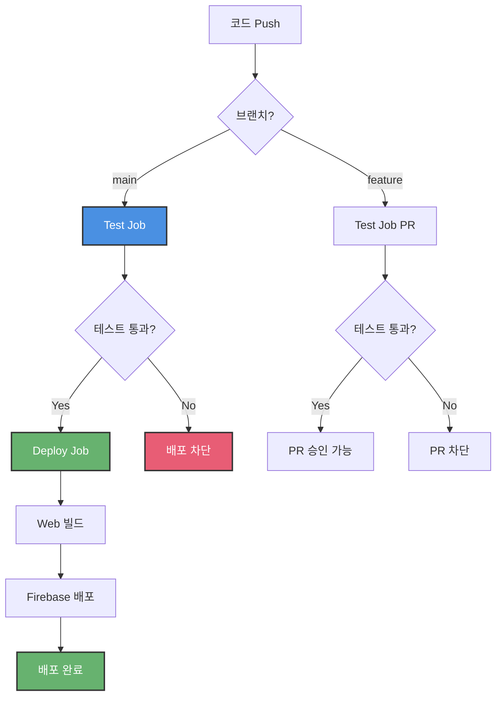

# CI/CD 설정 가이드

Good Morning 앱을 위한 GitHub Actions CI/CD 파이프라인 설정 가이드입니다.

## 📋 목차

1. [워크플로우 구성](#워크플로우-구성)
2. [초기 설정](#초기-설정)
3. [Firebase 배포 설정](#firebase-배포-설정)
4. [사용 방법](#사용-방법)
5. [트러블슈팅](#트러블슈팅)

---

## 워크플로우 구성

### 1. Test Workflow (`.github/workflows/test.yml`)

**트리거:**
- `main` 브랜치에 push
- 모든 브랜치에서 PR 생성

**작업:**
1. ✅ 코드 체크아웃
2. ✅ Flutter 환경 설정 (3.24.0)
3. ✅ 의존성 설치 (`flutter pub get`)
4. ✅ 코드 분석 (`flutter analyze`)
5. ✅ 테스트 실행 (`flutter test --coverage`)
6. ✅ 커버리지 업로드 (Codecov)

**소요 시간:** 약 3-5분

---

### 2. Deploy Workflow (`.github/workflows/deploy.yml`)

**트리거:**
- `main` 브랜치에 push만

**작업:**
1. **Test Job** (배포 전 안전장치)
   - 78개 테스트 전체 실행
   - 실패 시 배포 차단

2. **Deploy Job** (Test 통과 시만 실행)
   - Web 빌드 (`flutter build web --release`)
   - Firebase Hosting 자동 배포

**소요 시간:** 약 5-7분 (테스트 3분 + 빌드/배포 3분)

---

## 초기 설정

### 1. GitHub Repository 설정

이미 생성되어 있으므로 별도 작업 불필요

### 2. Codecov 설정 (선택사항)

커버리지 리포트를 보고 싶다면:

1. [Codecov](https://codecov.io) 접속
2. GitHub 계정으로 로그인
3. `good-morning` 저장소 활성화
4. Codecov Token 복사

**GitHub Secrets 추가:**
```
Repository Settings → Secrets and variables → Actions
→ New repository secret

Name: CODECOV_TOKEN
Value: (복사한 토큰)
```

---

## Firebase 배포 설정

### 1. Firebase Service Account 생성

```bash
# Firebase 프로젝트 ID 확인
firebase projects:list

# Service Account 키 생성
firebase login:ci
# 또는
firebase projects:administer
```

**Google Cloud Console에서 생성:**
1. [Google Cloud Console](https://console.cloud.google.com) 접속
2. 프로젝트 선택 (good-morning)
3. "IAM 및 관리자" → "서비스 계정"
4. "서비스 계정 만들기"
   - 이름: `github-actions`
   - 역할: `Firebase Hosting Admin`
5. "키 추가" → "새 키 만들기" → JSON
6. 다운로드된 JSON 파일 내용 복사

### 2. GitHub Secrets 설정

```
Repository Settings → Secrets and variables → Actions
→ New repository secret
```

**필수 Secrets:**

| Name | Value | 설명 |
|------|-------|------|
| `FIREBASE_SERVICE_ACCOUNT` | (JSON 전체 내용) | Firebase 배포 권한 |
| `FIREBASE_PROJECT_ID` | `good-morning-xxxxx` | Firebase 프로젝트 ID |

**확인 방법:**
```bash
# Firebase 프로젝트 ID 확인
cat .firebaserc
# 또는
firebase projects:list
```

### 3. Firebase Hosting 설정 확인

`firebase.json` 파일 확인:

```json
{
  "hosting": {
    "public": "build/web",
    "ignore": [
      "firebase.json",
      "**/.*",
      "**/node_modules/**"
    ]
  }
}
```

---

## 사용 방법

### 일반 개발 흐름

```bash
# 1. 새 기능 개발
git checkout -b feature/new-feature
# ... 코드 작성 ...

# 2. 커밋 & 푸시
git add .
git commit -m "feat: 새 기능 추가"
git push origin feature/new-feature

# 3. PR 생성 (GitHub에서)
# → 자동으로 테스트 실행
# → 78개 테스트 통과 확인

# 4. PR 병합 (GitHub에서)
# → main 브랜치로 자동 병합
# → 테스트 재실행
# → 테스트 통과 시 자동 배포
```

### 긴급 수정 (Hotfix)

```bash
# main 브랜치에서 직접 수정
git checkout main
git pull

# 수정 후 즉시 푸시
git add .
git commit -m "fix: 긴급 버그 수정"
git push origin main

# → 자동 테스트 + 배포 (5-7분)
```

### 로컬 테스트 (푸시 전 확인)

```bash
# CI와 동일한 테스트 실행
flutter test

# 코드 분석
flutter analyze

# 빌드 테스트
flutter build web --release
```

---

## CI/CD 워크플로우 흐름도



---

## 모니터링

### 1. GitHub Actions 탭

```
Repository → Actions 탭
→ 모든 워크플로우 실행 기록 확인
```

**확인 가능 정보:**
- 각 단계별 실행 시간
- 테스트 결과
- 배포 상태
- 에러 로그

### 2. 이메일 알림

실패 시 자동으로 이메일 발송:
- 테스트 실패
- 빌드 실패
- 배포 실패

### 3. PR Status Checks

PR에 자동으로 표시:
- ✅ All checks have passed
- ❌ Some checks failed

---

## 트러블슈팅

### 테스트 실패

```bash
# 로컬에서 재현
flutter test

# 특정 테스트만 실행
flutter test test/models/routine_suggestion_test.dart

# 자세한 로그
flutter test --verbose
```

### 빌드 실패

```bash
# 로컬에서 빌드 테스트
flutter clean
flutter pub get
flutter build web --release

# 캐시 문제 시
rm -rf build/
rm -rf .dart_tool/
```

### Firebase 배포 실패

**권한 오류:**
```
Error: HTTP Error: 403, The caller does not have permission
```

**해결:**
- Service Account 권한 확인
- `Firebase Hosting Admin` 역할 부여
- `FIREBASE_SERVICE_ACCOUNT` Secret 재생성

**프로젝트 ID 오류:**
```
Error: Invalid project id
```

**해결:**
```bash
# 올바른 프로젝트 ID 확인
firebase projects:list

# GitHub Secret 업데이트
FIREBASE_PROJECT_ID = (올바른 ID)
```

---

## 비용

### GitHub Actions

- **Public Repository**: 무제한 무료
- **Private Repository**: 월 2,000분 무료
  - 초과 시: $0.008/분

**Good Morning 앱 예상 사용량:**
- 1회 실행: 5분
- 하루 10번 푸시: 50분
- 월간: 약 1,000분
- **비용: $0 (무료 범위 내)**

### Firebase Hosting

- 10GB 저장소 무료
- 월 360MB 전송 무료
- **비용: $0 (소규모 프로젝트)**

---

## 다음 단계

- [ ] GitHub Secrets 설정 완료
- [ ] 첫 워크플로우 실행 테스트
- [ ] PR 생성해서 테스트 확인
- [ ] main 푸시해서 자동 배포 확인

## 참고 자료

- [GitHub Actions 문서](https://docs.github.com/en/actions)
- [Flutter CI/CD](https://docs.flutter.dev/deployment/cd)
- [Firebase Hosting GitHub Action](https://github.com/FirebaseExtended/action-hosting-deploy)
- [Codecov](https://docs.codecov.com/docs)
