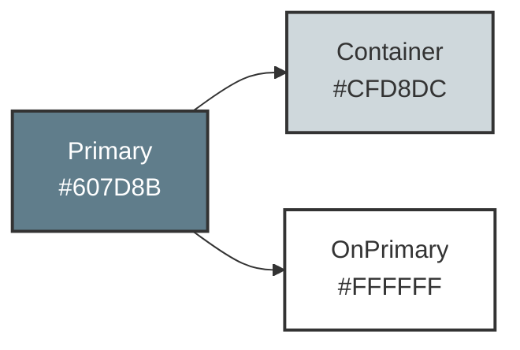
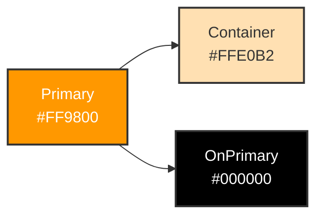
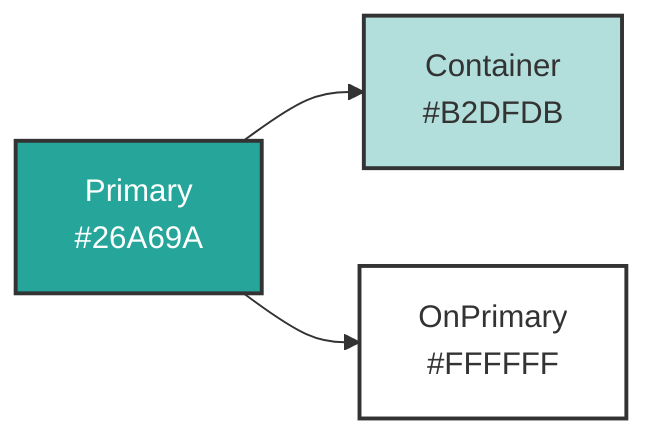
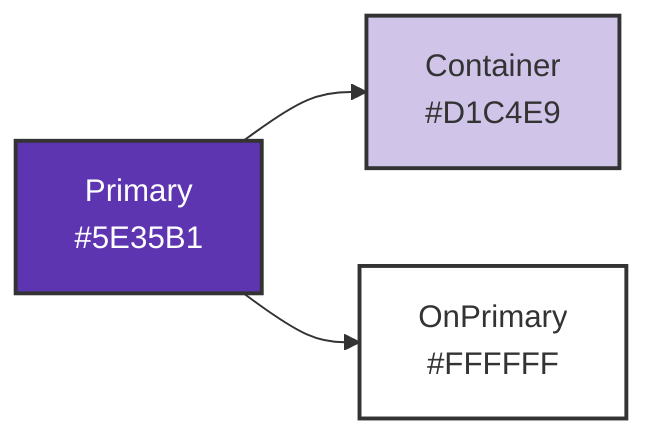
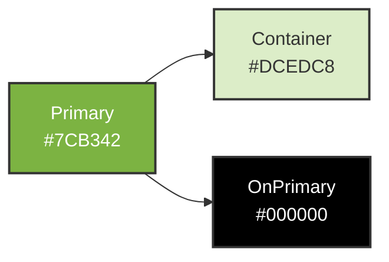

# Good Morning 앱 컬러 팔레트 옵션

현재 앱은 **Blue Grey (#607D8B)** 기반의 중립적인 디자인을 사용하고 있습니다.
아래 4가지 대안을 제안합니다.

---

## 옵션 1: Sunrise (현재 기본값)

**컨셉**: 중립적이고 실험 오염 방지 목적

```dart
seedColor: const Color(0xFF607D8B), // Blue Grey
```

**느낌**: 차분하고 기능적, 감정 유도 최소화



---

## 옵션 2: Morning Energy (따뜻한 아침)

**컨셉**: 상쾌하고 에너지 넘치는 아침 느낌

```dart
seedColor: const Color(0xFFFF9800), // Amber
```

**느낌**: 햇살, 활기, 긍정적



---

## 옵션 3: Fresh Start (민트/청록)

**컨셉**: 상쾌하고 깨끗한 아침 시작

```dart
seedColor: const Color(0xFF26A69A), // Teal
```

**느낌**: 신선함, 집중력, 청량감



---

## 옵션 4: Deep Focus (보라/남색)

**컨셉**: 생산성과 집중력 강조

```dart
seedColor: const Color(0xFF5E35B1), // Deep Purple
```

**느낌**: 전문적, 침착함, 몰입



---

## 옵션 5: Natural Balance (초록/올리브)

**컨셉**: 자연스럽고 안정적인 루틴

```dart
seedColor: const Color(0xFF7CB342), // Light Green
```

**느낌**: 균형, 성장, 안정감



---

## UI 적용 예시 비교

### 현재 (Blue Grey)

```
┌─────────────────────────────┐
│ 🌅 좋은 아침이에요, Taylor!  │ ← primaryContainer (회색빛)
│ 오늘은 평일 출근 루틴을 추천해요│
└─────────────────────────────┘

[앵커 타임: 09:00] ← FilledButton.tonal (차분한 회색)
[출근] [재택] ← SegmentedButton

✓ 명상 20분 ← primaryContainer (선택 시 회색)
□ 샤워 15분
```

### Morning Energy (Amber)

```
┌─────────────────────────────┐
│ 🌅 좋은 아침이에요, Taylor!  │ ← primaryContainer (따뜻한 주황)
│ 오늘은 평일 출근 루틴을 추천해요│
└─────────────────────────────┘

[앵커 타임: 09:00] ← FilledButton.tonal (황금빛)
[출근] [재택] ← SegmentedButton

✓ 명상 20분 ← primaryContainer (선택 시 주황)
□ 샤워 15분
```

### Fresh Start (Teal)

```
┌─────────────────────────────┐
│ 🌅 좋은 아침이에요, Taylor!  │ ← primaryContainer (민트)
│ 오늘은 평일 출근 루틴을 추천해요│
└─────────────────────────────┘

[앵커 타임: 09:00] ← FilledButton.tonal (청록)
[출근] [재택] ← SegmentedButton

✓ 명상 20분 ← primaryContainer (선택 시 민트)
□ 샤워 15분
```

---

## 추천 순위

### 1위: Fresh Start (Teal #26A69A)
- ✅ 아침 느낌 강함
- ✅ 중립성과 에너지 균형
- ✅ Material Design 가이드라인과 잘 맞음
- ✅ 실험 오염 최소 (차분하면서도 구분됨)

### 2위: Natural Balance (Light Green #7CB342)
- ✅ 루틴/습관 앱과 잘 어울림
- ✅ 안정감
- ⚠️ 다소 평범할 수 있음

### 3위: Morning Energy (Amber #FF9800)
- ✅ 강한 아침 느낌
- ⚠️ 너무 강조될 수 있음 (실험 오염 가능성)
- ⚠️ 시각적 피로도 높을 수 있음

### 4위: Deep Focus (Deep Purple #5E35B1)
- ✅ 생산성 앱 느낌
- ⚠️ 아침 느낌 약함
- ⚠️ 다소 무거울 수 있음

---

## 변경 방법

`lib/core/theme/app_theme.dart` 파일에서 `seedColor` 값만 변경하면 됩니다:

```dart
// 현재
seedColor: const Color(0xFF607D8B), // Blue Grey

// 변경 예시 (Fresh Start)
seedColor: const Color(0xFF26A69A), // Teal
```

Material 3의 동적 컬러 시스템이 자동으로 다음을 생성합니다:
- primary, primaryContainer, onPrimary
- secondary, secondaryContainer, onSecondary
- tertiary, tertiaryContainer, onTertiary
- surface, surfaceVariant, outline
- error, errorContainer, onError

---

## 다음 단계

1. 위 옵션 중 선택
2. `app_theme.dart` 수정
3. 앱 재실행 (Hot Reload만으로 충분)
4. 실제 화면에서 확인 후 미세 조정

어떤 옵션이 마음에 드시나요?
