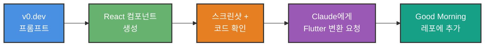

# v0.dev + GitHub 연동 가이드

## v0.dev의 GitHub 연동 기능

### 현재 지원 여부 (2026년 2월 기준)

v0.dev는 **제한적인 GitHub 연동**을 지원합니다:

#### ✅ 가능한 것
1. **생성된 코드를 GitHub에 푸시**
   - v0.dev에서 만든 React 컴포넌트 → 자동으로 레포에 커밋
   - 새로운 브랜치 생성하여 PR 생성

2. **기존 Next.js/React 프로젝트에 추가**
   - v0.dev 컴포넌트를 기존 레포의 컴포넌트로 추가

#### ❌ 불가능한 것
1. **GitHub 레포 코드를 v0에서 읽기**
   - v0는 기존 코드베이스를 분석하지 못함
   - Flutter 코드를 보고 React로 변환 불가능

2. **Flutter 프로젝트 직접 연동**
   - v0는 React/Next.js만 지원
   - Flutter 레포에 직접 푸시 불가

---

## 추천 워크플로우

### 옵션 1: v0.dev에서 디자인만 생성 → 수동 Flutter 변환 (추천)



**장점**:
- ✅ 가장 빠르고 간단
- ✅ v0의 디자인만 가져옴 (고품질)
- ✅ Flutter 프로젝트 구조 유지

**단점**:
- ⚠️ 수동 변환 필요 (하지만 AI가 도와줌)

---

### 옵션 2: Cursor AI에게 기존 코드 기반 프롬프트 작성 요청

v0에 넣을 프롬프트를 제가 기존 코드를 분석해서 작성해드립니다.

#### Step 1: 기존 코드 분석

제가 현재 `SuggestionCard` 위젯을 분석해서:
```dart
// 현재 구조
- GreetingSection (인사 + AI 추론)
- Anchor Time Card (앵커 + 출퇴근)
- Block List (체크박스 목록)
- Summary + Start Button
```

#### Step 2: v0 프롬프트 생성

위 구조를 기반으로 더 상세한 프롬프트 작성:
```
Create a mobile app screen matching this exact structure:

[기존 위젯 구조를 텍스트로 상세 설명]

Current implementation uses:
- Card elevation: 1
- Border radius: 12px
- Primary color: #5E35B1
- Selected item background: primaryContainer (0.3 opacity)
- Font sizes: titleMedium (22px), bodyLarge (16px)
...
```

#### Step 3: v0 생성

이 프롬프트로 v0에서 생성하면 현재 디자인과 매우 유사한 결과물이 나옵니다.

**장점**:
- ✅ 기존 디자인 유지
- ✅ 일관성 보장

**단점**:
- ⚠️ 새로운 디자인 시도 어려움

---

### 옵션 3: v0 결과물을 별도 브랜치로 관리

v0에서 생성한 React 코드를 참고용으로 레포에 저장:

```bash
# 별도 브랜치 생성
git checkout -b design/v0-prototypes

# v0 결과물 저장 폴더
mkdir -p design-prototypes/v0-react/
cd design-prototypes/v0-react/

# v0 코드 복사
design-prototypes/
  └── v0-react/
      ├── start-screen.tsx
      ├── now-screen.tsx
      ├── history-screen.tsx
      └── README.md (v0 링크 + 스크린샷)
```

**활용**:
- 디자인 참고용
- 나중에 웹 버전 만들 때 재사용
- 디자이너와 공유

---

## 실전 가이드: v0 + Claude 워크플로우

### Step 1: v0에서 생성

현재 `SuggestionCard`를 기반으로 개선된 프롬프트를 드릴게요:

```
Create a mobile morning routine suggestion card with these exact specifications:

LAYOUT STRUCTURE:
1. Greeting Card (top):
   - Background: Light purple (#D1C4E9) with 30% opacity
   - Border radius: 12px
   - Padding: 16px
   - Content:
     • Left: Greeting text "좋은 아침이에요!" (bold, 18px)
     • Right: Time chip with sun icon "7:30 기상"
     • Below: Small gray text explaining AI reasoning
   
2. Anchor Time Card:
   - White background
   - Border radius: 12px
   - Padding: 12px
   - Content:
     • Row: Flag icon + "앵커 타임" label
     • Right: Large tappable button showing "09:00" (deep purple #5E35B1)
     • Below: Segmented button (full width):
       - Option 1: "출근" with building icon
       - Option 2: "재택" with home icon
       - Selected: deep purple background
   
3. Block List Header:
   - Horizontal row: "블록 구성" (left) + "전체 선택" button (right)
   - Font: 16px medium weight
   
4. Block Items (list):
   Each item is a card with:
   - Margin bottom: 4px
   - Border radius: 12px
   - Padding: 8px horizontal, 4px vertical
   - Selected state: light purple background (#D1C4E9, 30% opacity)
   - Unselected state: white background, text has line-through
   - Content layout:
     • Left: Checkbox (purple when checked)
     • Center: Block name (e.g., "명상", "샤워")
     • Right: Duration badge (e.g., "20분") with gray background
   
5. Bottom Summary (if items selected):
   - Horizontal row:
     • Left: "3개 · 65분" (bold)
     • Right: "07:55 → 09:00" (small, gray)
   - Full-width purple button below:
     • Text: "이대로 시작" (16px, white)
     • Height: 48px
     • Border radius: 8px

DESIGN TOKENS:
- Primary color: #5E35B1 (Deep Purple)
- Primary container: #D1C4E9 (Light Purple)
- Surface: #FFFFFF
- Outline: #9E9E9E
- Spacing: 4, 8, 12, 16, 24
- Border radius: 8, 12
- Elevation: 1 (subtle shadow)

INTERACTIONS:
- Anchor time button: tappable, shows time picker
- Segmented button: toggle between options
- Block items: tap anywhere to toggle checkbox
- "전체 선택": toggles all checkboxes
- "이대로 시작": disabled if no blocks selected

Reference style: Material Design 3, similar to Google Tasks or Todoist
Make it feel premium and focused.
```

### Step 2: v0 결과 확인

생성되면:
1. 스크린샷 저장
2. 코드 복사 (React/TSX)
3. 저에게 공유

### Step 3: Flutter 변환 요청

저에게 이렇게 요청:
```
"v0에서 생성한 이 React 코드를 
현재 Good Morning 프로젝트의 SuggestionCard 위젯으로 
변환해줘. 기존 Provider 연결은 유지하고."
```

제가 해드릴 것:
- React JSX → Flutter Widget 변환
- Tailwind classes → Flutter styling
- 기존 `onAnchorTimeTap`, `onBlockToggle` 등 콜백 유지
- Material 3 위젯 사용
- 기존 프로젝트 구조에 맞게 조정

---

## 현재 코드 분석 (참고용)

제가 분석한 현재 `SuggestionCard` 구조:

```dart
// 파일: lib/screens/start/widgets/suggestion_card.dart

SuggestionCard (main widget)
├── _GreetingSection
│   ├── greeting text
│   ├── wakeUpTime chip
│   └── reasoning text
├── Anchor Time Card
│   ├── Flag icon + label
│   ├── FilledButton.tonal (time)
│   └── SegmentedButton (commute)
├── Block List Header
│   ├── "블록 구성" text
│   └── "전체 선택/해제" button
├── Block Items (mapped)
│   └── _BlockTile widgets
├── Empty State (if no blocks)
└── Summary + Start Button
    ├── Summary row
    └── FilledButton ("이대로 시작")

_BlockTile (sub-widget)
├── Checkbox
├── Block name
└── Duration badge
```

이 구조를 v0 프롬프트에 반영하면 일관성 있는 디자인이 나옵니다.

---

## 추가 팁

### v0에서 더 나은 결과를 얻는 법

1. **구체적인 px 값 제공**
   ```
   ❌ "Add some padding"
   ✅ "Padding: 16px all sides"
   ```

2. **컬러 코드 명시**
   ```
   ❌ "Use purple"
   ✅ "Use #5E35B1 for primary color"
   ```

3. **참고 앱 언급**
   ```
   ✅ "Similar to Google Tasks card style"
   ✅ "Like Todoist's clean interface"
   ```

4. **Material Design 명시**
   ```
   ✅ "Use Material Design 3 elevation-1 shadow"
   ✅ "Material 3 segmented button style"
   ```

### v0 생성 후 수정

만약 결과가 마음에 안 들면:
```
"Make the cards more spacious"
"Increase text size for better readability"
"Add more spacing between items"
"Make the primary button more prominent"
```

---

## 결론

### 권장 워크플로우

```
1. 위의 상세 프롬프트를 v0.dev에 입력
2. 생성된 디자인 확인 (수정 필요시 프롬프트 조정)
3. React 코드 + 스크린샷을 저에게 공유
4. 제가 Flutter 코드로 변환
5. 기존 프로젝트에 통합
```

**GitHub 연동은 필요 없습니다!**
- v0는 디자인 생성만 잘하면 됨
- Flutter 변환은 제가 도와드림
- 깃 관리는 기존 방식 유지

---

## 다음 단계

1. ✅ v0.dev에서 위 프롬프트로 Start Screen 생성
2. ✅ 결과 스크린샷 저장
3. ✅ React 코드 복사
4. ✅ 저에게 공유
5. ✅ Flutter 변환 받기

지금 v0에서 생성 중이신가요? 결과 나오면 보여주세요!
